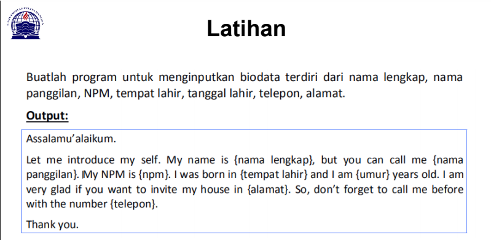
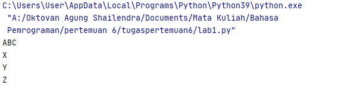
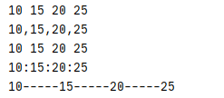
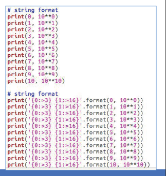
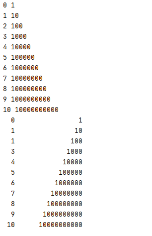
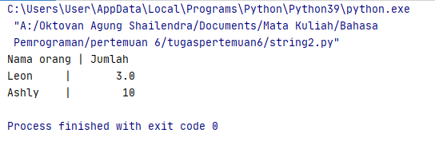
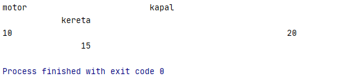
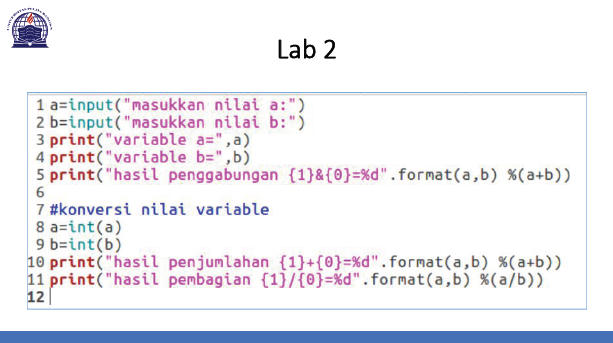
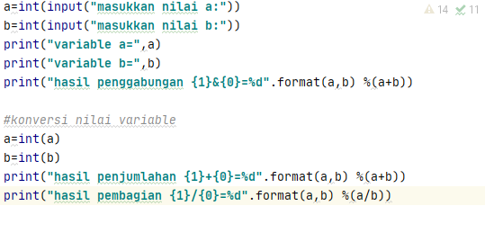
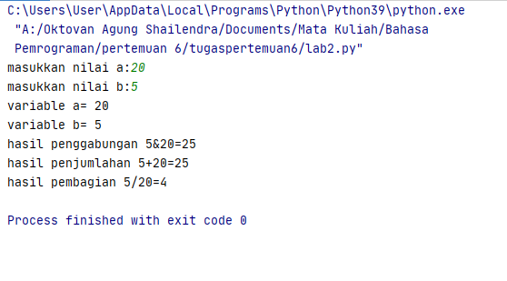

# **Tugas Ini Untuk Melengkapi Pertemuan Ke 6**

# Dan Menjelaskan Project


**Nama          : Oktovan Agung Shailendra** <br>
**Nim           : 312010131** <br>
**Kelas         : TI.20.A.1** <br>
**Mata Kuliah   : Bahasa Pemrograman**

DAFTAR ISI
| No | Description | Link |
| ----- | ----- | ----- |
| 1 | Tugas Pertemuan 5 | [click here](#pertemuan-5---tugas)
| 2 | Tugas Pertemuan 6 - Lab 1 | [click here](#pertemuan-6---lab-1)
| 3 | Tugas Pertemuan 6 - Lab 1 dan 2 | [click here](#pertemuan-6---lab-1-2)
 
## Pertemuan 5 - Tugas

Pada pertemuan 5 Bahasa Pemrograman saya diberi tugas oleh Dosen untuk membuat Aplikasi Biodata Python (seperti Gambar dibawah ini) <br>
 <br>
saat ini saya akan menjelaskan hasil dari tugas tersebut. <br>
Berikut *source code* nya : <br>

``` python

print("=========================================")
print("= NAMA    : Oktovan Agung Shailendra     ")
print("= NIM     : 312010131                    ")
print("= KELAS   : TI.20 A.1                    ")
print("=========================================")


print("Please enter your full name : Oktovan Agung Shailendra")
fullname=input()
print("Please enter nickname : Oktovan")
nickname=input()
print("Please enter your NiM : 312010131")
npm=input()
print("Please enter place of birth : BEKASI")
pob=input()
print("Please enter date of birth : 22")
date=input()
print("Please enter your month of birth : Oktober")
month=input()
print("Please enter year of birth : 2002")
year=input()
print("Please enter your phone number : 08995251170")
phone=input()
print("Please enter your address : Kp. Pule")
address=input()

dob=input("2020-year")

print("\n\n Assalamu'alaikum. ")
print("f\n Let me introduce my self, my name is {Oktovan Agung Shailendra}, but you can call me {Oktovan}, my NPM {312010131}, I was born in {BEKASI} and iam {18} years old, I am very glad if you want to invite my house in {Kp. Pule}, So don't forget to call me before with the number {08995251170}, \n\n Thanks you very much ")


```
# **Pertemuan 6 - Lab 1**

Pada bagian ini (Tugas Pertemuan 6 - Lab 1) saya diberikan tugas oleh Dosen yaitu mempelajari oprator aritmatika menggunakan Bahasa Pemrograman Python. Berikut source code yang di berikan oleh Dosen : <br>

``` python
#penggunaan end
print('A', end='')
print('B', end='')
print('C', end='')
print()
print('X')
print('Y')
print('z')

#penggunaan separator

`w, x, y, z = 10, 15, 20, 25`
`print(w, x, y, z)`
`print(w, x, y, z, sep=',')`
`print(w, x, y, z, sep='')`
`print(w, x, y, z, sep=':')`
`print(w, x, y, z, sep='.....')`

```
Baik, kali ini akan saya jelaskan materi yang di berikan oleh dosen.<br>

* penggunaan END
Penggunaan end digunakan untuk menambahkan karakter yang dicetak di akhir baris, secara default penggunaan end adalah untuk ganti baris. <br>

``` python
`print('A', end='')`
`print('B', end='')`
`print('C', end='')`

```

`> penggunaan print () digunakan untuk mencetak output, seperti syntax dibawah ini :`

``` python
`print('X')`
`print('Y')`
`print('Z')`

```
Hasil dari source code tersebut seperti gambar dibawah ini :<br>





* Peggunaan SEPARATOR

`> pendeklarasian beberapa variabel beserta nilainya`

``` python
w, x, y, z = 19, 15, 20, 15

```

`> Menampilkan hasil dari variable tiap - tiap variable`

``` python

`print(w, x, y, z)`

```

`> Menampulkan hasil dari tiap - tiap variabel dengan menggunakan pemisah : (koma)`

``` python

`print(w, x, y, z, =',')`
```

`> Menampilkan hasil dari tiap - tiap variable dengan menggunakan pemisah : (spasi)`

``` python

`print(w, x, y, z, ='')`

```

`> Menampilkan hasil tiap - tiap variable dengan menggunakan pemisah : (titik dua)`

``` python

`print(w, x, y, z, sep=':')`

```
`> Menampilkan hasil dari tiap - tiap variabel dengan menggunakan pemisah : (strip)`

``` python

`print(w, x, y, z, sep='-----')`

```

* Hasil dari syntex / source code diatas seperti gambar berikut ini : <br>




<br>
<hr>
<br>

## Pertemuan 6 - Lab 1 dan 2

* String Format<br>
String formatting atau string meemungkinkan kita menyuntikan item kedalam string dari pada kita mencoba menggabungkan string menggunakan koma atau string concatenation.<br>

* Penggunaan source code yang di berikan oleh Dosen seperti berikut : <br>



``` python

# string format 2
print(0, 10**0)
print(1, 10**1)
print(2, 10**2)
print(3, 10**3)
print(4, 10**4)
print(5, 10**5)
print(6, 10**6)
print(7, 10**7)
print(8, 10**8)
print(9, 10**9)
print(10, 10**10)

# string format 2
print('{0:>3} {1:>16}'.format(0, 10**0))
print('{0:>3} {1:>16}'.format(1, 10**1))
print('{0:>3} {1:>16}'.format(1, 10**2))
print('{0:>3} {1:>16}'.format(3, 10**3))
print('{0:>3} {1:>16}'.format(4, 10**4))
print('{0:>3} {1:>16}'.format(5, 10**5))
print('{0:>3} {1:>16}'.format(6, 10**6))
print('{0:>3} {1:>16}'.format(7, 10**7))
print('{0:>3} {1:>16}'.format(8, 10**8))
print('{0:>3} {1:>16}'.format(9, 10**9))
print('{0:>3} {1:>16}'.format(10, 10**10))

```

<br>
Saat ini akan saya bahas tentang satu persatuan dari syntax yang telah diberikan oleh Dosen.
<br>

1. **String Format 1** <br>
Pada syntax / source code string format 1 akan menampilkan output berupa 2 outputtan.<br>
Yang pertama (sebalah kiri) akan menampilkan angka urut dari angka 0 hingga 10, sedangkan untuk sebelah kanan akan menampilkan Oprasi Aritmatika Pangkat.<br>
Dengan ketentuan sebagai berikut, Oprasi pangkat dengan angka kiri sebagai pokok (Rumus : ** [bintang dua].)<br>



2. **string Format 2** <br>

Pada syntax atau code string dormat duaakan menampilkan output berupa dua outputan juga (seperti String Format 1, yaitu kiri dan kanan)<br>
Dengan ketentuan sebagai berikut : <br>
> Secara Default, **.format()** menggunakan rata kiri, angka ke kanan. Kita dapat menggunakan opsi opsional <,^, atau > untuk mengukur perataan kiri, tengah, atau kanan.<br>
Contoh lain dalam penggunaan **.format()** sebagai berikut : <br>

``` python
`print('{0:8} | {1:9}'.format('Nama orang','Jumlah'))`
`print('{0:8} | {1:9}'.format('Leon',3.))`
`print('{0:8} | {1:9}'.format('Ashly',10))`

```

Hasil dari souce code contoh diatas akan seperti gambari berikut :<br>



> Secara Default,**.format()** menggunakan rata text ke kiri, angka ke kanan, kita dapat menggunakan opsi opsional <, ^, atau > untuk mengatur perataan kir, tengah, atau kanan.<br>
Contoh kain dalam penggunaan **.format()** sebagai berikut : <br>

``` Python

`print('{:<30}{:30}{:>30}'.format('mobil','ufo','pesawat'))`
`print('{:<30}{:30}{:>30}'.format(10,20,15))`

```

hasil dari source code contoh diatas akan seperti gambar berikut :<br>



<br><br>

* Konversi Nilai Variable
Untuk pembahasan terakhir kali ini akan menyelesaikan tugas Lab 2dari Dosen, yaitu Konversi Nilai Variable<br>


String Format 2

# Variable adalah tampat menyimpan data

# menaruh / assignment nilai
`a = 10`
`x = 5`
`panjang = 1000`
`print(0, 10**0)`

#pemanggilan pertama
`print("Nilai a =", a)`
`print("Nilai x =", x)`
`print("Nilai panjang = ",panjang)`

# penamaan
`nilai_y = 15 # dengan menggunakan underscore`
`juta10 = 1000000 # ini boleh`
`nilaiZ = 17.5 # ini boleh`

# pemanggilan kedua
`print("Nilai a = ", a)`
`a = 7`
`print("Nilai b = ", a)`

# assignment indirect
`b = a`
`print("Nilai b = ",b)`

`a=int(input("masukkan nilai a:"))`
`b=int(input("masukkan nilai b:"))`
`print("variable a=",a)`
`print("variable b=",b)`
`print("hasil penggabungan {1}&{0}=%d".format(a,b) %(a+b))`

# konversi nilai variable
`a=int(a)`
`b=int(b)`
`print("hasil pejumlahan {1}+{0}=%d".format(a,b) %(a+b))`
`print("hasil pembagian {1}/{0}=%d".format(a,b) %(a/b))`



Dan hasilnya akan seperti gambar di bawah ini :<br>



<br><hr><br>

#**TERIMA KASIH**